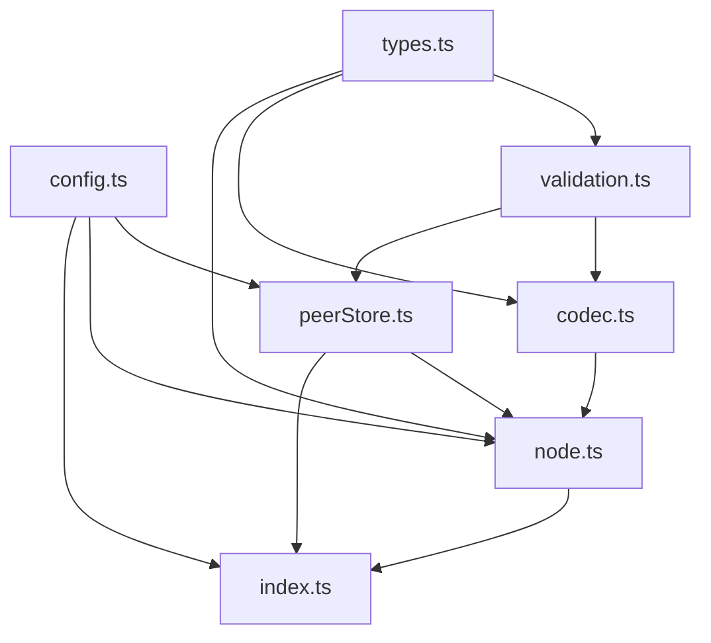

# Project Dependency Diagram

```mermaid
flowchart TD
    types[types.ts]
    config[config.ts]
    validation[validation.ts]
    codec[codec.ts]
    peerStore[peerStore.ts]
    node[node.ts]
    index[index.ts]
    types --> validation
    types --> codec
    validation --> codec
    validation --> peerStore
    config --> peerStore
    config --> node
    codec --> node
    peerStore --> node
    types --> node
    node --> index
    peerStore --> index
    config --> index
```
